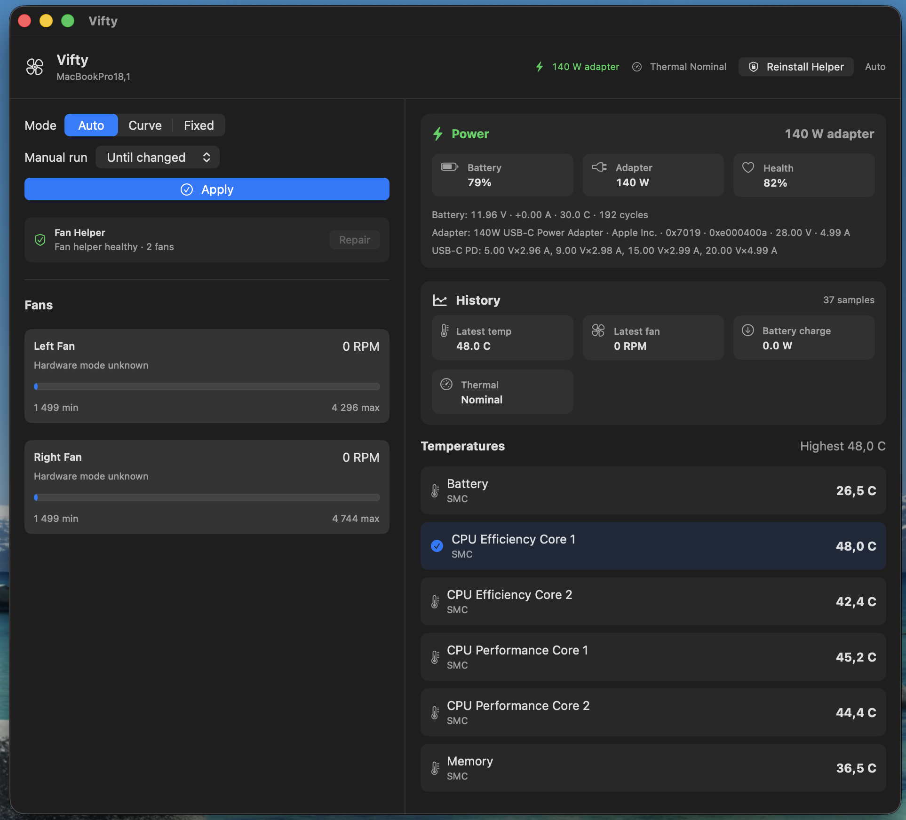

# Vifty

Open-source, local-first thermal control for Apple Silicon MacBook Pro developers. Vifty focuses on safe local thermal control for Apple Silicon MacBook Pro developer workloads: builds, tests, and local AI coding agents. It combines live thermals, fan RPM control, reusable temperature curves, bounded `viftyctl` cooling leases, and USB-C/MagSafe power telemetry in one SwiftUI utility.


[](https://github.com/Reedtrullz/Vifty/actions/workflows/ci.yml)


Vifty is built for local signed distribution, not the App Store. It uses private macOS SMC/HID interfaces for fan and sensor access, keeps data on-device, and refuses manual control on unsupported hardware.

Apple can change private SMC/HID behavior in macOS or new hardware revisions without notice. Vifty treats unknown fan topology, missing sensors, invalid ranges, or drifting SMC mode/target telemetry as a reason to stay in macOS Auto and collect read-only evidence first. Do not use raw SMC tools or manual fan writes to "try a new model into support."



## Highlights

- **Menu bar cockpit** — selected-sensor temperature, primary or average fan RPM, and power state at a glance.
- **Three fan modes** — Auto, Fixed RPM with optional percentage-aware per-fan targets, and a 3-point Temperature Curve.
- **Curve profiles** — save, name, switch, overwrite, and delete fan curves, including per-fan RPM overrides; profiles persist across restarts.
- **Developer presets** — conservative curve presets for tests, builds, and local model runs.
- **Hardware fan state** — shows actual SMC Auto/Forced/System mode and target RPM when available.
- **Live temperature panel** — all SMC and HID sensors with source labels and highest-temperature tracking.
- **Live power tracking** — battery percentage, charge/drain watts, signed battery current, adapter wattage, negotiated USB-C voltage/current, health, cycle count, battery temperature, and USB-C PD profiles from local IOKit data.
- **Thermal pressure** — surfaces macOS thermal-pressure state alongside raw temperatures, and flags high selected-sensor temperatures when macOS has not raised thermal pressure.
- **Timed manual modes** — Fixed RPM and Temperature Curve modes can automatically restore Auto after a selected duration.
- **Power insights** — estimates battery runtime from live drain and warns when plugged in but still draining.
- **Telemetry history** — shows subtle in-memory trend sparklines for recent selected temperature, fan RPM, power flow, and thermal-pressure state; samples stay local and reset with the app.
- **Optional local notifications** — alerts for helper failure, sustained high thermal pressure, Auto restore failure, plugged-in battery drain, and agent cooling that needs attention; all are off by default.
- **Privileged helper architecture** — a LaunchDaemon/XPC helper owns root SMC writes so the app does not need repeated permission prompts.
- **Helper health summary** — distinguishes healthy daemon-backed fan data from helper errors, unreachable daemon state, fallback fan telemetry with daemon repair needed, and empty snapshots, with recovery guidance, main-window and menu-bar repair actions, read-only diagnose-command copy, immediate post-repair refresh, and blocked manual controls when fan writes are not safe to start.
- **Agent-friendly cooling leases** — local agents can use bundled `viftyctl` JSON commands to inspect readiness, request bounded temporary cooling for builds/tests, and restore Auto with visible active/pending recovery state and daemon-owned expiry.
- **Installer workflow** — double-click `Install Vifty.command`, run `make install`, or build a reusable `.pkg`.
- **Safety defaults** — RPM clamping, unsupported-hardware refusal, auto-restore on sensor loss, and unclean-exit recovery.
- **Debug helper CLI** — `ViftyHelper` can probe SMC state and restore Auto from Terminal.

## Why Vifty matters

Mac fan control has been dominated by proprietary closed-source tools for years. Vifty is different:

Vifty is not trying to be a general-purpose system monitor yet; its wedge is auditable fan control, bounded agent cooling, helper recovery, and evidence-backed compatibility for Apple Silicon MacBook Pro developers.

- **Open-source and auditable** — every SMC write path, RPM clamp, and safety check is visible. You can verify that fan control does exactly what it claims.
- **Agent-safe by design** — the `viftyctl` agent CLI is a purpose-built open-source thermal management interface for AI coding agents. Leases carry bounded durations, reasons, idempotency keys, policy metadata, and retry-after signals; the daemon enforces expiry independently.
- **Developer workload context** — fan control, charger-power telemetry, and thermal pressure are shown together so builds, tests, and local agents have the thermal context they need without turning Vifty into a broad monitoring suite.
- **Privileged helper architecture** — the root daemon owns SMC writes so the app never needs repeated permission prompts, and unprivileged direct AppleSMC writes are refused (fail-closed).

The current competitive positioning and roadmap live in [docs/competitive-analysis.md](docs/competitive-analysis.md). The short version: Vifty should beat mature Mac utilities by being safer, more inspectable, and better suited to developer workloads, not by cloning every general-monitoring panel first.

If you use Apple Silicon for builds, tests, or AI workloads, Vifty keeps your machine cool and your fan control auditable.

## Supported scope

V1 targets Apple Silicon MacBook Pro models on macOS 15+. Compatibility claims are evidence-based; see [docs/compatibility.md](docs/compatibility.md) for the current validation status and [docs/hardware-validation.md](docs/hardware-validation.md) for the report procedure.

Vifty intentionally excludes HDD/SSD S.M.A.R.T., Boot Camp, Windows support, analytics, cloud sync, and non-MacBook-Pro fan control. Unsupported Macs should remain under macOS automatic fan control; see [docs/unsupported-hardware.md](docs/unsupported-hardware.md) for the safe-block policy.

For help or reports, start with [SUPPORT.md](SUPPORT.md). For hardware validation, `make validation-evidence` wraps the read-only release/hardware collector with explicit install-source provenance before any fan-write smoke; clean source checkouts can use `make validation-evidence-current-build` to build `.build/Vifty.app` first, capture the read-only helper `probeLocal` output, and record the current git ref/SHA as local ad-hoc evidence. For agent/build/test cooling, helper-unreachable, and restore-failure reports, `scripts/collect-agent-cooling-evidence.sh` collects a read-only support bundle with viftyctl JSON, launchd/helper install evidence, optional `--guarded-run-stderr-file <path>` wrapper decision evidence, and `privacy-review.tsv` before sharing, without requesting cooling or writing fan state. Source checkouts can use `make agent-cooling-evidence`, adding `AGENT_EVIDENCE_GUARDED_RUN_STDERR=/path/to/guarded-run.stderr make agent-cooling-evidence` when a guarded wrapper stderr transcript already exists. Installed app bundles include `Contents/Resources/collect-agent-cooling-evidence.sh` for that read-only path, `Contents/Resources/check-manual-smoke-readiness.sh` for the read-only manual Fixed/Curve smoke preflight, `Contents/Resources/check-agent-run-smoke-readiness.sh` for the read-only preflight before supervised workload smoke, `Contents/Resources/collect-agent-run-smoke-evidence.sh` for supervised supported-hardware workload smoke evidence after that preflight is safe, and `Contents/Resources/viftyctl-wrappers/` for the guarded `viftyctl run --json` workload wrappers; clean source checkouts can use `make manual-smoke-readiness-current-build` before human manual smoke to build `.build/Vifty.app`, verify safe readiness, and require that the installed LaunchDaemon helper hash matches the freshly built `ViftyDaemon`. Then use `make agent-run-smoke-readiness-current-build` before workload smoke, and use `make agent-run-smoke-evidence-current-build` only after that preflight reports safe readiness to record `installSource=local-ad-hoc-build` with the current git ref/SHA and run the same bounded smoke through the freshly built `viftyctl`. The smoke bundle records that boundary in `daemon-runtime.tsv` and `agent-run-smoke-evidence-summary.json`; guarded workload wrappers now require `runLifecycle.resolvedChildExecutableReported=true` so completed run reports identify the cooled child executable, and current runs include `resolvedChildExecutableSHA256Status` plus `resolvedChildExecutableSHA256` when the executable bytes are readable. Maintainers can review read-only bundles with `scripts/review-agent-cooling-evidence.sh` before triage. Use [docs/support-triage.md](docs/support-triage.md) so release, hardware, helper, SMC telemetry, agent-cooling, and UI issues stay evidence-based.

The current checked-in developer-workload evidence includes `docs/validation-reports/2026-06-18-macbookpro18-main-agent-run-smoke/review-result.json`, which records MacBookPro18,1 local-ad-hoc `agentRunSmokeResult: "passed-auto-restored"`. That proves one reviewed bounded `viftyctl run` smoke restored Auto on that M1 Pro report, but MacBookPro18 still needs manual smoke before Vifty claims validated hardware support.

## Install and launch

### Current release trust status

The latest published public release is Vifty `v1.1.1`, a source-first hotfix release because the project does not currently have Apple Developer Program credentials. There is no Developer ID signed or notarized public binary for `v1.1.1`, and the canonical notarized artifact name `Vifty-v1.1.1.zip` is reserved for a future Developer ID release.

The immutable `v1.1.1` source tag is `a82f2237ff39c24a6b366dca8f95a17ee54fd972`. Later `main` commits may contain post-release hardening, but they are not part of the published `v1.1.1` source release unless a future release is cut.

An optional `Vifty-v1.1.1-unsigned-dev.zip` convenience app is attached to the GitHub Release for testers. It is ad-hoc signed, not notarized, not the official trusted binary, and macOS may show Gatekeeper warnings. The unsigned-dev zip is valid only with its `.sha256` sidecar, and the SHA-256 digest in that sidecar must match the zip bytes. See [docs/release-status.md](docs/release-status.md) before treating any binary path as trusted.

Superseded release: the published `v1.1.0` source/unsigned-dev release predates helper-install hardening and may leave the app showing "Fan helper unreachable" after update. Do not retag `v1.1.0` or silently replace its assets; use the `v1.1.1` source-first hotfix release instead.

Auto-update is future trusted-binary work, not enabled for source-first or unsigned-dev builds. See [docs/auto-update.md](docs/auto-update.md) for the Sparkle/Developer ID plan.

### Install trust levels

1. **Source build:** recommended while Apple Developer Program credentials are unavailable. Build from the immutable source tag and run the local verification suite before installing.
2. **Unsigned tester app:** optional `Vifty-v1.1.1-unsigned-dev.zip` convenience build for testers who understand Gatekeeper warnings. It is valid only with a matching `.sha256` digest sidecar, not Developer ID signed, not notarized, not Homebrew-trusted, and not the official trusted binary.
3. **Future trusted binary:** Developer ID signed, notarized, stapled, checksum-verified, and then eligible for Homebrew. This lane stays unavailable until Apple credentials exist and the release verifier passes.

### Why a privileged helper?

The normal SwiftUI app and `viftyctl` stay unprivileged. Fan writes need a root-owned path because macOS protects AppleSMC write calls, so the LaunchDaemon owns the narrow root path for SMC fan writes while the UI and CLI request bounded intent over XPC.

That helper may write only Vifty's allowlisted fan mode keys `F{n}Md` / `F{n}md`, fan target keys `F{n}Tg`, and guarded `Ftst` unlock cleanup. Temperature, power, thermal pressure, fan mode telemetry, and diagnostics stay read-only through local IOKit or daemon snapshots. See [docs/trust-model.md](docs/trust-model.md) for the detailed trust boundary.

### From source

For normal local use:

1. Double-click **`Install Vifty.command`** in this repository. It builds a release app, installs it, registers it with Launch Services, and launches Vifty.
2. Or run:

```sh
make install
```

After installation, start Vifty from Spotlight, Launchpad, Finder, or Terminal:

```sh
open /Applications/Vifty.app
```

`make install` installs to `/Applications/Vifty.app` when writable and falls back to `~/Applications/Vifty.app` otherwise. If Vifty is already running, the installer quits and relaunches it from the newly installed bundle so the menu bar item reflects the current build. If you want a reusable installer file, run `make pkg` and open the generated `.build/Vifty-<version>.pkg`.

### Unsigned tester zip

For v1.1.1 tester convenience after the source tag is published:

```sh
git fetch origin main --tags
git checkout v1.1.1
make verify
make source-first-release-notes
make unsigned-dev-artifact
make source-first-readiness
```

This verifies the immutable tag before generating release notes or the unsigned tester artifact. It writes `.build/Vifty-v1.1.1-source-first-release-notes.md`, creates `.build/Vifty-v1.1.1-unsigned-dev.zip` plus `.build/Vifty-v1.1.1-unsigned-dev.zip.sha256`, and checks the published source-first GitHub Release state, including that the sidecar digest matches the zip bytes when the optional unsigned-dev assets are attached. The unsigned artifact target requires the working source to match the `v1.1.1` tag by default, so later `main` hardening cannot accidentally produce a zip named as the release attachment. Do not rename the unsigned artifact to `Vifty-v1.1.1.zip`; that name is reserved for a future signed and notarized release.

To audit the already-published `v1.1.0` boundary, check out `v1.1.0` and set `RELEASE_VERSION=1.1.0`. Do not use the `v1.1.0` artifact target to refresh public tester assets from post-release `main`; use the `v1.1.1` hotfix release instead.

### Homebrew

The Homebrew cask is intentionally disabled and parked until Vifty has a Developer ID signed, notarized, stapled, and verifier-passing `Vifty-v<version>.zip` release artifact. Do not use Homebrew as the recommended or trusted source-first install path, and do not point the cask at unsigned-dev artifacts. For public binary trust, a future cask artifact must pass `scripts/verify-release-artifact.sh --team-id <TEAMID>` after a signed/notarized release checksum is published.

## Build and verify

Requires macOS 15, Xcode 16, and Swift 6.

```sh
# Run local trust gates: community/support surface, source-first release metadata, tests,
# warnings-as-errors, release bundle, plist lint, codesign verification,
# and viftyctl identifier check
make verify

# Run the XCTest suite
swift test

# Build an ad-hoc-signed app bundle at .build/Vifty.app
make app CONFIGURATION=release

# Build the optional source-first unsigned tester zip and checksum
make unsigned-dev-artifact

# Write source-first release notes and check the published release lane
make source-first-release-notes
make source-first-readiness

# Install the release app bundle
make install

# Optional: build an unsigned local installer package in .build/
make pkg
```

GitHub Actions runs the same verification on every push to `main`, every pull request targeting `main`, and manual `workflow_dispatch`: Swift tests, release app bundle build, plist validation, ad-hoc code-signature verification, temporary install-script verification, and a zipped `Vifty.app` artifact upload.

The app bundle is signed ad-hoc with `codesign --sign -`. The local `.pkg` is unsigned and intended for local development/test installs; the app inside remains ad-hoc signed.

Source-first releases use `make source-first-release-notes`, `make unsigned-dev-artifact`, and `make source-first-readiness`; the unsigned-dev target requires `UNSIGNED_DEV_SOURCE_REF` to match the current source and defaults to `v<version>`, while the readiness target calls `scripts/check-release-readiness.sh --mode source-first` and allows only clearly named `Vifty-v<version>-unsigned-dev.zip` convenience builds whose attached `.sha256` digest matches the zip bytes. Tagged public Developer ID releases use the separate [release workflow](docs/release.md), which requires Developer ID signing, TeamID XPC allowlisting, Apple notarization, stapling, and SHA-256 checksum publication.

After a public release artifact and cask checksum are published, `scripts/verify-release-artifact.sh --team-id <TEAMID>` verifies the cask SHA, bundle version, bundled release and agent JSON Schemas and stable IDs, signing TeamID, LaunchDaemon TeamID allowlist, stapled notarization ticket, and Gatekeeper assessment. The release workflow publishes a JSON artifact summary and release checklist for reviewer evidence, and `scripts/collect-validation-evidence.sh --release-summary <path> --release-checklist <path>` can copy those files into hardware-validation bundles while marking the release-summary row nonzero for skipped or failed verifier checks, checksum mismatches, artifact-name drift, schema drift, or version mismatch, and marking the release-checklist row nonzero for version drift or missing follow-up sections.

## Power tracking

The power panel is inspired by projects like [`MacBook-Charger-Power-Indicator`](https://github.com/unrelatedlabs/MacBook-Charger-Power-Indicator), but Vifty keeps the implementation inside its existing Swift/IOKit model layer. `PowerInfoReader` gathers:

- `IOPSCopyPowerSourcesInfo` battery status and time estimates.
- `AppleSmartBattery` registry values for voltage, signed amperage, capacity, cycles, condition, and temperature.
- `IOPSCopyExternalPowerAdapterDetails` adapter wattage, USB-C PD negotiation, manufacturer/model metadata, and advertised PD profiles.

The UI displays a compact menu-bar summary (`96 W adapter`, `16.9 W drain`, etc.) plus a detailed Power panel next to the temperature sensors. Power telemetry is read locally and does not require the privileged fan helper. When live drain and capacity data are available, Vifty estimates time remaining and warns if the Mac is plugged in but the battery is still draining.

## Architecture

```
┌────────────────────────────────────────────────────────────┐
│ Vifty.app (SwiftUI menu bar + window)                      │
│  AppModel                                                  │
│   ├─ PowerInfoReader ── local IOKit power/battery data     │
│   └─ FanControlCoordinator                                 │
│        ├─ ViftyDaemonClient ── XPC ── root LaunchDaemon    │
│        └─ RealMacHardwareService ── local SMC fallback     │
│                                                            │
│ ViftyDaemon                                                │
│  tech.reidar.vifty.daemon ── AppleSMC IOKit                │
└────────────────────────────────────────────────────────────┘
```

| Package | Type | Role |
|---------|------|------|
| `Vifty` | executable | SwiftUI menu bar app and main window |
| `ViftyCore` | library | Models, SMC client, fan coordinator, power snapshots, daemon protocol |
| `ViftyDaemon` | executable | Privileged XPC daemon that reads/writes fan SMC keys as root |
| `ViftyHelper` | executable | CLI for direct SMC probing and emergency fan restoration |
| `ViftyCtl` | executable | Agent-friendly JSON CLI for bounded cooling leases |
| `ViftyPrivateIOKit` | library | C/IOKit bridge for HID temperature sensors |

**Data flow:** the app polls every 2 seconds. Fan control resolves the selected mode into per-fan RPM targets, then writes through the daemon when available. Power telemetry is read directly from local macOS IOKit dictionaries. Curve profiles and private app preferences, including menu-bar mode, notification toggles, and fixed-mode per-fan targets, are persisted as JSON in `~/Library/Application Support/Vifty/`.

## Safety and privacy

For the detailed privileged-helper and agent-control boundaries, see [docs/trust-model.md](docs/trust-model.md).

- Fan RPM targets are clamped to `[minRPM, maxRPM]` per fan.
- Low-level SMC writes are allowlisted to Vifty's fan mode, fan target, and guarded force-test keys.
- Hardware must be Apple Silicon + MacBookPro before manual fan control is enabled.
- Manual fan modes can be time-limited so Vifty restores Auto automatically.
- The UI distinguishes Vifty's selected mode from the hardware-reported SMC mode when that SMC key is available.
- If temperature sensors disappear mid-curve, Vifty restores Auto.
- An unclean-exit marker (`~/Library/Application Support/Vifty/manual-control-active`) is written while manual control is active; the next launch restores Auto before continuing.
- Curve profiles are stored in `~/Library/Application Support/Vifty/curve-profiles.json` with a `.bak` backup before each save.
- Power, thermal, and telemetry-history data stay on the Mac. Trend sparklines and readouts are rendered from the in-memory rolling buffer only; there are no analytics, accounts, network uploads, cloud dependencies, or persistent telemetry export.
- Local notifications use macOS UserNotifications only. They are opt-in, rate-limited, and do not add analytics, network calls, or persistent telemetry export.

### Optional: Harden XPC with your TeamID

By default Vifty accepts any ad-hoc-signed binary with the correct signing identifier over XPC — this keeps the project buildable by anyone who clones it. If you have an Apple Developer account, you can lock the daemon to only accept binaries signed by your team:

1. Find your TeamID: `make app CONFIGURATION=release SIGNING_IDENTITY="Apple Development"` then `codesign -dvvv .build/Vifty.app 2>&1 | grep TeamIdentifier`
2. Build with your identity and TeamID: `make app CONFIGURATION=release SIGNING_IDENTITY="Apple Development" VIFTY_XPC_ALLOWED_TEAM_ID="<TEAMID>"`
3. Verify the daemon plist contains `VIFTY_XPC_ALLOWED_TEAM_ID`: `plutil -p .build/Vifty.app/Contents/Library/LaunchDaemons/tech.reidar.vifty.daemon.plist`

When `VIFTY_XPC_ALLOWED_TEAM_ID` is set, the root daemon only accepts XPC clients with Vifty's signing identifiers and that TeamID. Leave it empty for local ad-hoc development builds.

## Fail-safe recovery

If manual fan control misbehaves, restore Auto before trying anything else:

> `AppleSMC call failed with kIOReturnNotPrivileged (-536870207)` means macOS rejected a direct fan write because it was not running through the privileged helper/root path. In the app or menu bar, use **Reinstall Helper** or **Repair Helper** and approve the helper if System Settings asks. From Terminal, direct `ViftyHelper setFixed` / `auto` writes require `sudo`.

If repair still leaves the helper unreachable or telemetry-only, use **Copy Support Evidence** in the main window or menu bar. It copies a read-only support command that captures `viftyctl` readiness plus helper install/launchd evidence and the current Vifty UI context when the bundled collector is available, including whether Fixed or Curve is pending while fan writes are blocked. It falls back to `viftyctl diagnose --json` otherwise. It does not request cooling, restore Auto, call `ViftyHelper`, or write fan state.

1. In the Vifty UI, select **Auto** in the Mode picker and click **Apply**.
2. If the UI is unavailable, use the helper CLI from the repo root after building release binaries. First inspect supported fans and their limits:

   ```sh
   sudo .build/release/ViftyHelper probeLocal
   ```

   Then restore Auto for each fan ID using its reported minimum and maximum RPM:

   ```sh
   sudo .build/release/ViftyHelper auto 0 <minRPM> <maxRPM>
   sudo .build/release/ViftyHelper auto 1 <minRPM> <maxRPM>
   ```

3. To stop the privileged daemon while troubleshooting, unload it from launchd:

   ```sh
   sudo launchctl bootout system /Library/LaunchDaemons/tech.reidar.vifty.daemon.plist
   ```

4. If fan state is still unclear, reboot macOS so the firmware/system controller and launchd return to normal startup state.

Do not run manual fan control on unsupported hardware. Follow [docs/unsupported-hardware.md](docs/unsupported-hardware.md) instead.

## ViftyHelper CLI

```sh
ViftyHelper probe              # Full hardware snapshot via daemon
ViftyHelper probeLocal         # Direct SMC read (no daemon)
ViftyHelper readKey <key>      # Read raw SMC key, e.g. F0Ac
ViftyHelper setFixed <id> <rpm> <min> <max>
ViftyHelper auto <id> <min> <max>
ViftyHelper smcDiagnostics     # IOKit service discovery dump
```

## viftyctl agent CLI

`viftyctl` is bundled at:

```sh
/Applications/Vifty.app/Contents/MacOS/viftyctl
```

It is designed for local AI/coding agents and shell automation. It exposes structured JSON and bounded workload leases rather than arbitrary raw SMC writes:

```sh
viftyctl status --json
viftyctl capabilities --json
viftyctl diagnose --json
viftyctl audit --limit 20 --json
viftyctl prepare --workload build --duration 25m --max-rpm-percent 75 --reason "Swift release build" --idempotency-key "$(uuidgen)" --json
viftyctl restore-auto --reason "workload complete" --json
viftyctl run --workload test --duration 20m --max-rpm-percent 70 --reason "swift test" -- swift test
```

`--idempotency-key` belongs to `prepare` / `run` lease requests only. `restore-auto` is intentionally not key-scoped; keep it in the same supervised lifecycle that prepared cooling. When `restore-auto` succeeds, the CLI also clears the local `manualControlActive` marker that `diagnose --json` uses as a restore-first gate.

`capabilities --json` returns the supported commands, supported workload names, source schema paths, installed bundle schema resource paths, guarded wrapper resource paths/script names, stable schema IDs, shell exit-code meanings, `runLifecycle` guarantees for `viftyctl run`, `directControlLifecycle` guarantees for direct prepare/restore, `supportsForceRetry`, metadata limits for reasons/idempotency keys, and a policy object. `wrapperResources` uses source-tree and app-bundle-relative paths so agents can discover the audited installed/source wrappers without Vifty leaking user-specific absolute paths in evidence bundles. When `policyStatusAvailable: true`, that policy object is daemon-backed and includes limits such as max lease duration, allowed RPM percent range, and prepare cooldown. Agents may trust `policy.*` duration/RPM limits only when `policyStatusAvailable: true`; if the field is missing or false, treat the policy object as discovery/fallback data only and refuse agent cooling. Agents must also require `policy.enabled: true` before requesting cooling; `policy.enabled: false` means local agent cooling is disabled even if a stale readiness payload looks safe. If the daemon status cannot be read, it still prints the static command contract with `daemonStatusAvailable: false`, `policyStatusAvailable: false`, `policySource: "fallbackUnavailable"`, a disabled fallback policy, and exits with `exitCodes.unavailable`. Rate-limited decisions include `retryAfterSeconds` so supervised agents can wait without parsing human text only when `supportsForceRetry` is true.

Successful `status --json`, `prepare --json`, and `restore-auto --json` payloads include `schemaVersion: 1`, `schemaID: "https://vifty.local/schemas/viftyctl-status.schema.json"`, and `generatedAt` while keeping `enabled`, `activeLease`, `lastDecision`, `lastErrorCode`, and `policy` at the top level for existing agents.

`diagnose --json` is a read-only readiness report for agents, release testers, and hardware validation. It combines daemon snapshot telemetry, thermal pressure, fan hardware mode/target data, agent policy/status, explicit `ready` / `degraded` / `blocked` checks, and machine-readable `recommendedAgentAction` / `recommendedRecoveryAction` / `safeToRequestCooling` / `daemonControlPathReady` fields, including invalid or duplicate controllable fan IDs, the local `manualControlActive` marker, and `appPreferences.startupMode` for diagnosing whether Vifty's saved default mode may reassert manual control. Current reports also include `failedCheckIDs` and `coolingBlockerIDs` so agents can show every failed readiness check and the hard-stop subset without parsing prose. If Vifty/manual fan control is active, diagnose emits `manualControlClear` failed with `recommendedAgentAction: "restoreAutoBeforeRequestingCooling"` so agents restore Auto or ask the user before taking ownership; a successful CLI `restore-auto` clears that same local marker before the next diagnose. If `manualControlActive` stays true after one restore, inspect `appPreferences.startupMode`, then stop and switch Vifty/default startup mode to Auto before another cooling request. If the daemon snapshot or agent-control status cannot be read, the command still emits a structured `blocked` report with `daemonSnapshotAvailable` / `agentControlStatusAvailable` / `daemonControlPathReady` failure checks, `recommendedRecoveryAction: "repairHelper"`, and exits 75 after printing JSON. See [docs/hardware-validation.md](docs/hardware-validation.md) for the release-test matrix, [docs/unsupported-hardware.md](docs/unsupported-hardware.md) for blocked unsupported Macs, and use the GitHub Hardware Validation Report issue template when contributing compatibility evidence.

`audit --json` is a read-only local audit export for recent agent lease events. It returns `readOnly: true`, `coolingCommandsRun: false`, the requested `limit`, `eventCount`, and timestamped events with action, optional lease ID, and message. Use it after blocked readiness or restore failures to show what Vifty actually did without requesting cooling.

For the short runbook, see [docs/safe-agent-cooling.md](docs/safe-agent-cooling.md). For a fuller contract, decision rules, canonical JSON examples, and ready-to-run wrappers for Swift, Xcode, Make, npm, cargo, pytest, local-model, and custom workloads, see [docs/agent-workflows.md](docs/agent-workflows.md) and [examples/viftyctl](examples/viftyctl/README.md). For Codex, Claude Code, Cursor, and shell-runner snippets, see [docs/agent-integrations.md](docs/agent-integrations.md).

### Agent readiness checklist

- Run `viftyctl capabilities --json` and require schema version `1`, the stable capabilities, diagnose, command-error, and run schema IDs, the advertised `run` lifecycle, `wrapperResources`, `supportsForceRetry`, supported workload names, metadata limits, `policyStatusAvailable: true`, `policy.enabled: true`, policy limits, and unavailable exit code before using guarded workloads.
- Run `viftyctl diagnose --json` before cooling; require diagnose readiness schema version `1`, `safeToRequestCooling: true`, `daemonControlPathReady: true`, and `manualControlActive: false`. If diagnose exits nonzero with a command-error payload, require the command-error schema identity advertised by capabilities before trusting recovery fields.
- Follow `recommendedAgentAction` and `recommendedRecoveryAction` instead of parsing UI text or human warning strings.
- Run `AGENT_RUN_SMOKE_READINESS_JSON=1 make agent-run-smoke-readiness` before supervised smoke evidence; require schemaID: `https://vifty.local/schemas/agent-run-smoke-readiness.schema.json`, require `readOnly: true`, `coolingCommandsRun: false`, safe readiness, helper readiness, daemon-backed policy, and daemon hash agreement when requested. Do not run `make agent-run-smoke-evidence` when readiness exits 75 or reports unsafe cooling.
- Prefer `/Applications/Vifty.app/Contents/Resources/viftyctl-wrappers/guarded-run.sh ... -- <command>` from an installed app, or `examples/viftyctl/guarded-run.sh ... -- <command>` from a source checkout. The workload wrappers for Swift, Xcode, Make, npm, cargo, pytest, local-model, and custom runs keep child validation, cooling, signal handling, and Auto restore in one lifecycle.
- When guarded-run refuses before cooling and prints captured JSON, extract only the payload between `guarded-run: BEGIN_VIFTY_CAPABILITIES_JSON` / `guarded-run: END_VIFTY_CAPABILITIES_JSON`, `guarded-run: BEGIN_VIFTY_DIAGNOSE_JSON` / `guarded-run: END_VIFTY_DIAGNOSE_JSON`, or `guarded-run: BEGIN_VIFTY_GUARDED_RUN_DECISION_JSON` / `guarded-run: END_VIFTY_GUARDED_RUN_DECISION_JSON`; decision payloads use `schemaID: https://vifty.local/schemas/guarded-run-decision.schema.json`, summarize whether cooling or uncooled fallback was requested/allowed, and include `decisionReason` for machine-readable refusal classification. Do not parse surrounding recovery prose.
- Use direct `viftyctl run --json -- <command>` only when the caller already performs the same readiness and child-command preflight.
- If readiness is `blocked` or `manualControlActive: true`, repair the helper, restore Auto once, back off the workload, or collect read-only evidence according to the JSON recovery fields instead of retrying cooling. If `manualControlActive` stays true after one restore, inspect `appPreferences.startupMode`, then stop and switch Vifty/default startup mode to Auto before another cooling request.
- Use `viftyctl audit --limit 20 --json` after blocked readiness or restore failures to inspect what happened locally.
- Use `VIFTY_GUARDED_RUN_FORCE_RETRY=1` only for supervised runs where the user approved waiting for `retryAfterSeconds` and retrying one rate-limited prepare.
- Use `VIFTY_GUARDED_RUN_ALLOW_UNCOOLED=1` only when the user explicitly accepts running without Vifty cooling after seeing the structured readiness result. The guarded wrapper still refuses helper-repair, restore-first, manual-control-active, backoff, policy-inspection, hardware-evidence, and daemon-control-unavailable states, and it refuses to combine uncooled fallback with `VIFTY_GUARDED_RUN_FORCE_RETRY=1`. Do not catch guarded-run failures and rerun workloads without cooling. Do not fall back to `sudo`, `ViftyHelper setFixed`, `ViftyHelper auto`, raw SMC tools, or direct helper writes.

For commands with `--json`, daemon/transport failures return a structured error object with `schemaVersion: 1`, `schemaID: "https://vifty.local/schemas/viftyctl-command-error.schema.json"`, `command`, `errorCode`, `message`, `safeToProceed: false`, and `recommendedRecoveryAction` instead of plain stderr text. Agents should compare the command-error `schemaID` with `capabilities.schemaIDs.commandError` before trusting command-error fields. Unknown, duplicate, missing-value, or unexpected wrapper arguments fail with `INVALID_ARGUMENTS` instead of being ignored, silently choosing one value, or generating a default value. `PREPARE_RATE_LIMITED` command errors include `retryAfterSeconds` when Vifty can report a retry wait. For `viftyctl run --json`, wrapper failures before the child starts, such as child-command resolution, prepare denial, or launch failure after a prepared lease, use the same structured command-error shape. Child command resolution/launch failures use `CHILD_COMMAND_FAILED` so agents do not confuse workload command problems with Vifty helper failures. If launch fails after cooling was prepared, the JSON also reports `coolingLeasePrepared`, `autoRestoreAttempted`, and `autoRestoreSucceeded` so agents can tell whether cleanup ran. After a child command has launched and exited, successful completed-run reports use `schemaVersion: 1` and `schemaID: "https://vifty.local/schemas/viftyctl-run.schema.json"`; agents should compare that with `capabilities.schemaIDs.run` before trusting `childExitCode`, `autoRestoreSucceeded`, `autoRestoreError`, `resolvedChildExecutable`, optional `resolvedChildExecutableSHA256`, or optional `resolvedChildExecutableSHA256Status`. Status `computed` means the digest field is present; `unavailable` means Vifty could not read or hash the executable bytes. Guarded wrappers refuse cooling when `runLifecycle.resolvedChildExecutableReported` is absent or false. Agents should use `recommendedRecoveryAction` for the next safe step instead of parsing human `message` text. Human-readable invocations keep the normal stderr failure path.

Safety rules:

- Agent control is local-only through the signed CLI and privileged daemon.
- Every prepare request carries a bounded duration and reason; the default daemon policy caps leases at 30 minutes, and the CLI supplies a default reason when one is omitted.
- `viftyctl prepare` exits nonzero when the daemon denies cooling or fails to return a matching active lease; `--json` still prints the structured status for automation.
- Expired leases stay visible in agent status and block new prepares until the daemon actually restores Auto, so automation can detect delayed or retried restores.
- RPM targets are computed from each fan's min/max range and clamped by policy.
- Invalid or duplicate controllable fan IDs block agent cooling before Vifty reaches the SMC write path.
- User Auto restore wins over active and in-flight agent cooling; a preempted prepare reports `RESTORE_REQUESTED`.
- `viftyctl run` resolves the child executable before preparing a lease, refuses to launch if prepare does not return a matching active lease, launches the resolved path, forwards common terminal/session signals to the child, and restores Auto on child launch failure, normal exit, or handled signal exit. Restore failures are surfaced on stderr and make an otherwise-successful wrapper exit nonzero; if the wrapper is force-killed or crashes, the daemon-owned lease monitor is the safety fallback.
- Sensor loss, unsupported hardware, helper uncertainty, or critical thermal pressure refuses or restores control.
- Agents should run `viftyctl diagnose --json` before long build/test workloads, use `safeToRequestCooling`, `daemonControlPathReady`, `manualControlActive`, and `coolingBlockerIDs` as hard machine-readable gates, follow `recommendedAgentAction` for normal, caution, restore-first, or stop behavior, and use `recommendedRecoveryAction` for repair-helper, restore-auto, backoff, policy, or hardware-evidence follow-up without parsing check messages.

### Rate limiting

A 30-second cooldown (configurable via `prepareCooldownSeconds` in `AgentControlPolicy`) prevents rapid prepare/restore cycles from thrashing fan RPM. Repeated calls within the window return `prepareRateLimited` error with retry-after metadata.

For human use, `--force` retries once after the cooldown expires:

```sh
viftyctl prepare --workload build --duration 25m --max-rpm-percent 75 --force --reason "build" --json
viftyctl run --workload test --duration 20m --max-rpm-percent 70 --force -- swift test
```

## Daemon installation

The app bundles a LaunchDaemon plist. When you choose **Install Helper**, **Approve Helper**, **Repair Helper**, or **Reinstall Helper**, Vifty starts the helper install or repair only after that user action; normal app launch only checks and reports helper status.

On macOS 13+, the helper action first uses `SMAppService.register()` for Login Items approval. If registration cannot complete or the helper needs repair, Vifty falls back to an administrator-prompted install via `osascript` to `/Library/PrivilegedHelperTools/` plus `launchctl bootstrap`.

The **Reinstall Helper** button retries this flow. The fallback installer stops any existing launchd service, copies `ViftyDaemon` to `/Library/PrivilegedHelperTools/tech.reidar.vifty.daemon`, removes stale `BundleProgram`, patches the staged LaunchDaemon plist with `ProgramArguments` pointing at that privileged-helper path, and then bootstraps and kickstarts launchd so the daemon can respond immediately after repair. It sets the helper and LaunchDaemon plist to `root:wheel` ownership, with the executable at `0755` and plist at `0644`, strips quarantine from the staged files, and pre-creates the daemon log files as `0600 root:wheel` before bootstrapping launchd.

## Project structure

```
Vifty/
├── Install Vifty.command       # Double-click installer launcher
├── Makefile                    # app/install/pkg targets
├── Package.swift
├── Resources/
│   ├── Info.plist
│   └── tech.reidar.vifty.daemon.plist
├── scripts/
│   ├── build-installer-pkg.sh
│   └── install-vifty.sh
├── Sources/
│   ├── Vifty/                  # Main app target
│   ├── ViftyCore/              # Shared models, fan control, SMC, power telemetry
│   ├── ViftyCtl/               # Agent-friendly JSON CLI
│   ├── ViftyDaemon/            # Privileged XPC daemon
│   ├── ViftyHelper/            # CLI helper
│   └── ViftyPrivateIOKit/      # C IOKit bridge
└── Tests/
    └── ViftyCoreTests/         # XCTest suite
```

## License

MIT. See [LICENSE](LICENSE).
